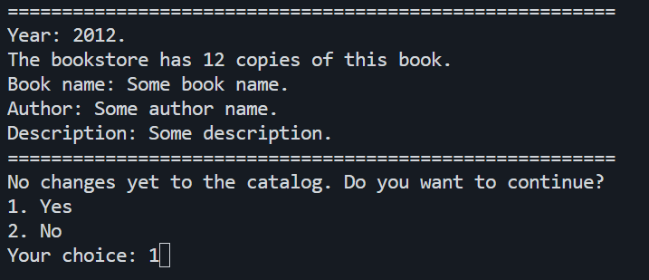

# My Bookstore
 Welcome to my bookstore! Ofc it is not an official one. Made in C++. It works in both Linux and Windows [^1]

# How to compile
 Type in the terminal the following if it is the first time:
 ```make run```

 If you modify something, I recommend you to do this:
 ``` make clean; make run ```

 # How to use the Makefile

 You need to type in terminal ```make rule_you_want``` in the same level of directory as the **Makefile** file. All *make* commands:
 
 |         Command         | Creates the executable | Cleans the objects | Cleans the log | Runs the program | Debug | Simple valgrind | Leak check | All valgrind info |
|:-----------------------:|:----------------------:|:------------------:|:--------------:|:----------------:|:-----:|:---------------:|:----------:|:-----------------:|
|        make (all)       |           yes          |          x         |        x       |         x        |   x   |        x        |      x     |         x         |
|        make clean       |            x           |         yes        |        x       |         x        |   x   |        x        |      x     |         x         |
|   make valgrind_clean   |            x           |          x         |       yes      |         x        |   x   |        x        |      x     |         x         |
|         make run        |           yes          |          x         |        x       |        yes       |   x   |        x        |      x     |         x         |
|        make debug       |           yes          |          x         |        x       |        yes       |   x   |        x        |      x     |         x         |
|      make valgrind      |           yes          |          x         |        x       |        yes       |   x   |       yes       |      x     |         x         |
| make valgrind_leakcheck |           yes          |          x         |        x       |        yes       |   x   |       yes       |     yes    |         x         |
|  make valgrind_extreme  |           yes          |          x         |        x       |        yes       |   x   |       yes       |     yes    |        yes        |

# Images of the menu




[^1]: For windows you need something like GNU Make to run it. It won't run without it.
